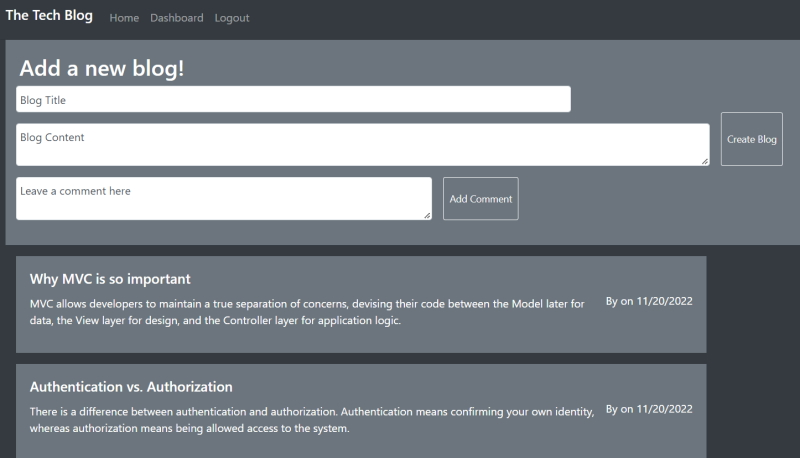

# mvc-tech-blog

# MVC Tech Blog

## Description

My Tech Blog front and back end application uses the model, view, controller folder/file structure to render a blog which a user can use to share their current coding lessons via a blog post. They can interact with other user blogs by leaving comments.

I was able practice using Handlebars to render data via HTML pages and sessions to store cookies. I got further practice at using Sequelize, seeding a database, creating routes, and implenting CRUD development, which is something I am still getting the hang of.

---

## Table of Contents

- [Installation](#installation)
- [Usage](#usage)
- [Future Development](#future-development)
- [License](#license)
- [Credits](#credits)

---

## Installation

The user will need to clone the application from my GitHub account: https://github.com/RosemaryJF/mvc-tech-blog, to their local repository, and install Node.js, mySQL and npm on their code editor, if it isn't already.

Once cloned to the local repository the user will need to run `npm i` or `npm install` so that the necessary packages are installed on the application.

Next the user should open the db folder in their integrated terminal. They should run the following command:

- `mysql -u root -p`

They will be prompted to enter their password, once this has been done and sql is running, they should enter:

- `SOURCE schema.sql`

This will create the database needed for the app to run.

The user should next edit the `.env.example` file to reflect their mySQL user and password, and remove the .EXAMPLE from the file name. It is already linked to the database created through the schema.

Once this is done they should navigate back to server.js file and run `node seeds/seed.js` in their integrated terminal; this will seed the database so that they can test the app's functionality.

From there the user will be able to launch the application from their intergrated terminal with either `node server.js` or `npm start`.

---

## Usage

To use the application the user can navigate to the Heruko deployment link here: https://secure-crag-48796.herokuapp.com/

From the homepage they will be able to view any existing blogs:

To get to the dashboard they will be prompted to log in:

If they are new they can head to the sign up to create an account:

Once this is done from the homepage the user now has the option to add a new blog, or delete a blog they have posted previously:

Once this is done the dashboard will refresh and the user can now see the newly added blog post.

The user also has the option to view an exisiting blog indivudually, from this page they can add a comment to an existing blog, or edit the blog they are viewing:

If the users page is idle for too long the application will log them out and they will prompted to sign in again to do anything other that view the homepage.

---

## Future Development

The add a comment and edit a blog functionality is still not working correctly. It is currently not returning any errors and I have been unable to debug why. This will be solved for future development.

---

## License

This application is licensed under an [MIT license](https://github.com/RosemaryJF/mvc-tech-blog/blob/main/LICENSE).

---

## Credits

- https://dev.mysql.com/doc/refman/8.0/en/blob.html

- https://dev.mysql.com/doc/refman/8.0/en/date-and-time-types.html

- https://momentjs.com/guides/#/warnings/js-date/

- https://momentjs.com/docs/#/parsing/
